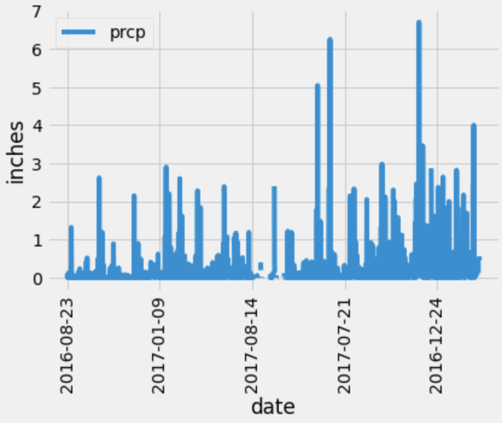
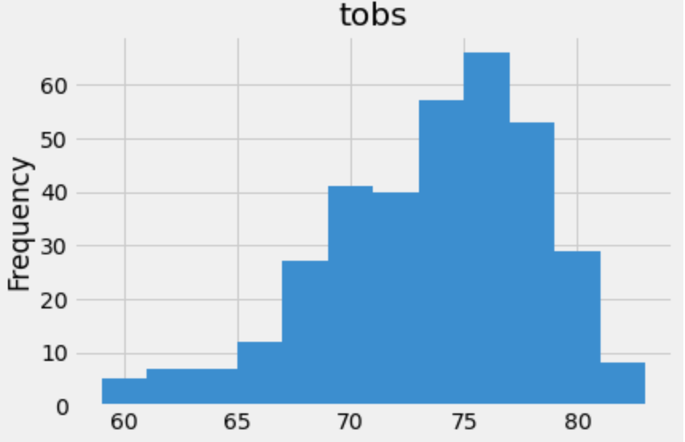
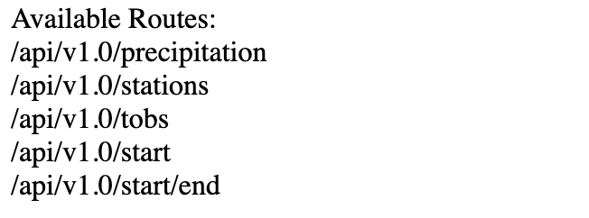

# Sqlite Challenge
h

### **Part 1: Climate Analysis and Exploration**

- **Created** engine to connect to the sqlite file `hawaii.sqlite`.
- **Used** automap to reflect the tables and to create the classes `Station` and `Measurement`.
- **Created** SQLAlchemy session.

#### **Precipitation Analysis**

- **Found** the most recent date in the dataset by using `func.max`

- **Used** this date to find the previous year of precipitation data 
    ``` py
    year_ago = dt.date(2017, 8, 23) - dt.timedelta(days=365)
    ```


- **Pushed** the information into a dataframe:

- **Plotted** the results:

  

- **Printed** the summary statistics for the precipitation data.

#### **Station Analysis**

- **Calculated** the total number of stations.

- **Found** the most active stations in the dataset by calculating the rows count of each unique station.

- **Found** the most active station by listing them in descending order.
    ``` py
    uniqueValuesCount = session.query(Measurement.station, func.count()).\
    group_by(Measurement.station).order_by(func.count().desc()).all()
    ```
- **Calculated** the lowest, highest and average temperature from column `tobs` table `Measurement`

- **Found** the previous year of temperature observation data for the most active station.
    ``` py 
    tempreture = session.query(Measurement.date, Measurement.tobs).\
    filter(Measurement.date >= year_ago).filter(Measurement.station == 'USC00519281').all()
    ```
- **Plotted** the results:

    


- - -

### Part 2: Design Your Climate App

**Used** Flask to create routes:
    

* `/`

    * Homepage.

* `/api/v1.0/precipitation`
    * **Converted** the results to a dictionary
    * **Returned** the dictionary.

* `/api/v1.0/stations`

    * **Returned** a list of the stations id.

* `/api/v1.0/tobs`
    * **Designed** a query for the dates and the temperature for the most active station during the previous year.
    * **Returned** a list of temperature.

* `/api/v1.0/<start>` and `/api/v1.0/<start>/<end>`

    * **Designed** a query to return a list of the highest, lowest and average temperature for all dates greater than or equal to the start date if we only given the start date.

    * **Designed** a query to return a list of the highest, lowest and average temperature for all dates greater than or equal to the start date and less than or equal to the end date if we given both start and end dates.

    ``` py 
    def temp_date(start, end):
    session = Session(engine)
    if end != None:
        results = session.query(func.min(Measurement.tobs), func.max(Measurement.tobs), func.avg(Measurement.tobs)) \
                         .filter(Measurement.date >= start).filter(Measurement.date <= end).all()
    else:
        results = session.query(func.min(Measurement.tobs), func.max(Measurement.tobs), func.avg(Measurement.tobs)) \
                         .filter(Measurement.date >= start).all()
    session.close()
    all_dates = list(np.ravel(results))
    return jsonify(all_dates)
    ```


